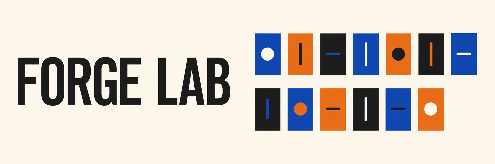

<p align="center">
  
  
  
  
</p>

**Treze microprojetos independentes para observar fundamentos de backend funcionando,
falhando e se recuperando.**

O ForgeLab transforma decisões de backend em experimentos pequenos e reproduzíveis.
Os temas vão de concorrência e recuperação de falhas até proteção de dados e entrega
de mensagens. Cada pasta responde a uma pergunta. O código mostra o mecanismo, os
testes protegem a regra e a evidência registra o que realmente aconteceu.

[Catálogo](#catálogo-dos-projetos) ·
[Rotas de estudo](#rotas-de-estudo) ·
[Resultados medidos](#resultados-medidos) ·
[Como executar](#como-executar)

> [!NOTE]
> A coleção está concluída em P12 e não receberá novos microprojetos. Futuras mudanças
> ficam restritas a correções, manutenção de dependências e atualização de evidências
> que deixarem de ser reproduzíveis.

## A ideia em uma imagem

```text
pergunta concreta
       |
       v
implementação pequena
       |
       v
falha controlada
       |
       v
teste + experimento
       |
       v
evidência + limite do que foi provado
```

O repositório não forma uma aplicação única. Cada projeto possui seu próprio ambiente,
dependências, testes, cenário e documentação. Essa separação permite abrir qualquer
pasta, entender uma decisão e executar o experimento sem carregar os demais projetos.

## O que existe aqui

- **13 projetos concluídos**, de P00 a P12.
- **Python 3.14** em todos os ambientes.
- **Uma pergunta principal por projeto**.
- **Uma falha reproduzível**, não apenas um caminho feliz.
- **Testes e evidências locais** ligados ao cenário executado.
- **Zero código compartilhado** entre projetos independentes.
- **Comandos originais** de `uv`, Ruff, Pyright, pytest, Docker e cada ferramenta.

## Mapa da coleção

```text
P00  Base reproduzível
 |
 +-- P01 a P04  Dados, concorrência, API e processo
 |
 +-- P05 a P08  Resiliência, paginação e integrações externas
 |
 +-- P09 a P11  Constraints, planos SQL e isolamento por tenant
 |
 +-- P12         Log de eventos e fila de mensagens
```

A ordem é uma sugestão, não uma dependência. Quem já conhece o básico pode começar
diretamente pelo problema que deseja investigar.

## Catálogo dos projetos

| Projeto                                                                                             | Conceitos visíveis                                                  | Pergunta principal                                           | Prova reproduzida                                                                                          |
| --------------------------------------------------------------------------------------------------- | ------------------------------------------------------------------- | ------------------------------------------------------------ | ---------------------------------------------------------------------------------------------------------- |
| [P00 · Ambiente reproduzível](./P00-ambiente-reproduzivel-com-uv/README.md)                         | `uv`, versões travadas, Ruff, Pyright, pytest                       | o ambiente nasce igual depois de ser apagado?                | a instalação limpa passa pelas verificações e as falhas de import e tipo são detectadas                    |
| [P01 · Validação tipada de JSONL](./P01-validacao-tipada-com-pydantic-e-jsonl/README.md)            | Pydantic, classificação, escrita segura                             | como aproveitar registros válidos sem esconder os inválidos? | seis linhas terminam classificadas: duas válidas e quatro rejeitadas                                       |
| [P02 · Asyncio, threads e processos](./P02-asyncio-threads-e-processos/README.md)                   | event loop, I/O, CPU, GIL, heartbeat                                | quando async, thread ou processo realmente ajudam?           | estratégias entregam o mesmo resultado, mas mudam tempo e responsividade                                   |
| [P03 · Contratos e injeção no FastAPI](./P03-fastapi-contratos-e-injecao-de-dependencias/README.md) | HTTP, Pydantic, `Depends`, service, repositório                     | como separar contrato, regra e persistência?                 | status `201`, `401`, `404`, `409`, `422` e `503` aparecem na fronteira correta                             |
| [P04 · Lifespan e tarefas de fundo](./P04-lifespan-middleware-e-background-tasks/README.md)         | lifespan, middleware, thread pool, `BackgroundTasks`                | o job termina se a API cair?                                 | o crash interrompe o job preso ao processo e o shutdown gracioso fecha os recursos                         |
| [P05 · Timeout, retry, backoff e jitter](./P05-timeout-retry-backoff-e-jitter/README.md)            | HTTPX, Tenacity, idempotência, `Retry-After`                        | quando repetir uma chamada é seguro?                         | falhas transitórias repetem; `400` e operação insegura param imediatamente                                 |
| [P06 · Circuit breaker e token bucket](./P06-circuit-breaker-e-token-bucket/README.md)              | circuito, `half-open`, rajada, configuração                         | quando parar de chamar um provedor?                          | três falhas abrem o circuito e uma rajada maior que o bucket é recusada localmente                         |
| [P07 · Paginação por cursor](./P07-paginacao-por-cursor/README.md)                                  | cursor opaco, snapshot, evolução de contrato                        | como paginar uma coleção que muda durante a leitura?         | `OFFSET` repete um item; o cursor preserva a janela original sem duplicidade                               |
| [P08 · Webhook, HMAC, inbox e idempotência](./P08-webhook-hmac-inbox-e-idempotencia/README.md)      | assinatura, replay, inbox, processamento em segundo plano           | como aceitar redelivery sem repetir o efeito?                | três entregas criam um registro e um efeito, inclusive após a falha controlada entre persistência e efeito |
| [P09 · Constraints e migrations](./P09-postgresql-constraints-e-migrations/README.md)               | PostgreSQL, FK, `NOT NULL`, `CHECK`, `UNIQUE`, Alembic              | como fazer o banco rejeitar estados impossíveis?             | quatro escritas inválidas falham e a migration sobe e desce sem correção manual                            |
| [P10 · EXPLAIN ANALYZE e índices](./P10-explain-analyze-e-indices/README.md)                        | planos, buffers, seletividade, N+1, projeção                        | como escolher um índice a partir de evidência?               | três desenhos de acesso são medidos e o N+1 é comparado com um único `JOIN`                                |
| [P11 · RLS e connection pool](./P11-postgresql-rls-e-connection-pool/README.md)                     | tenant, RLS, role, `SET LOCAL`, pool                                | como impedir que o contexto de tenant vaze pela conexão?     | o escopo de sessão vaza; a transação segura limpa o contexto após commit e rollback                        |
| [P12 · Kafka versus RabbitMQ](./P12-kafka-versus-rabbitmq/README.md)                                | partição, offset, grupo de consumidores, routing, `ack`, redelivery | o problema pede replay ou confirmação?                       | Kafka relê os seis eventos; RabbitMQ redelivera até receber `ack`                                          |

## Rotas de estudo

### Quero começar pelos fundamentos

```text
P00 -> P01 -> P03 -> P04
```

Essa rota começa pela reprodução do ambiente, passa por validação de dados, chega ao
contrato HTTP e termina no ciclo de vida do processo.

### Quero entender concorrência e ciclo de execução

```text
P02 -> P04
```

O P02 compara estratégias de I/O e CPU. O P04 mostra como uma chamada bloqueante e uma
tarefa presa ao processo afetam uma API.

### Quero estudar integrações resilientes

```text
P05 -> P06 -> P07 -> P08
```

A sequência cobre retry seletivo, circuit breaker, controle de rajada, paginação
mutável, assinatura de webhook e idempotência.

### Quero aprofundar PostgreSQL

```text
P09 -> P10 -> P11
```

Primeiro o schema protege invariantes. Depois o plano orienta índices e consultas. Por
fim, a RLS, segurança em nível de linha, isola tenants mesmo quando a consulta não
escreve o filtro manualmente.

### Quero comparar modelos de mensageria

```text
P08 -> P12
```

O P08 mostra a entrada idempotente de um evento externo. O P12 compara o histórico
reprocessável do Kafka com a confirmação de trabalho do RabbitMQ.

## Resultados medidos

Estes números pertencem aos ambientes descritos nas evidências. Eles tornam o
comportamento visível, mas não formam um teste universal de desempenho nem representam
capacidade de produção.

| Projeto | Resultado observado                                                                                                                          |
| ------- | -------------------------------------------------------------------------------------------------------------------------------------------- |
| P01     | 6 linhas de entrada resultaram em 2 válidas e 4 rejeitadas, sem perda silenciosa                                                             |
| P02     | `asyncio.gather` concluiu o I/O em 0,25 s contra 2,51 s no sequencial; processos concluíram a CPU em 0,79 s contra 2,26 s na execução direta |
| P04     | 4 requisições levaram 0,163 s em uma rota `def` e 0,608 s em uma rota assíncrona bloqueante; o job iniciado não terminou depois do crash     |
| P05     | duas respostas `500` exigiram esperas simuladas de 0,55 s e 1,10 s; `400` e operação insegura não receberam retry                            |
| P06     | uma rajada de 5 chamadas permitiu 3 e recusou 2; a terceira falha abriu o circuito                                                           |
| P08     | 3 entregas produziram 1 registro e 1 efeito; o evento salvo antes da falha controlada foi recuperado                                         |
| P10     | em 120 mil pedidos, o acesso alinhado usou `Index Only Scan`; N+1 fez 21 consultas e o `JOIN` fez 1                                          |
| P11     | a mesma conexão física vazou o tenant no modo inseguro; depois de commit e rollback seguros, uma consulta sem contexto viu 0 documentos      |
| P12     | um novo grupo de consumidores releu os 6 eventos; a mensagem rejeitada no RabbitMQ voltou 1 vez antes do `ack`                               |

Os arquivos dentro de `evidence/` guardam os resultados completos, planos, contratos ou
eventos produzidos por cada laboratório.

## Tecnologias usadas

| Área                 | Ferramentas e conceitos                                           |
| -------------------- | ----------------------------------------------------------------- |
| Ambiente e qualidade | Python 3.14, `uv`, Ruff, Pyright, pytest                          |
| Dados e contratos    | Pydantic, JSONL, YAML, OpenAPI                                    |
| API e HTTP           | FastAPI, Uvicorn, HTTPX, injeção de dependências                  |
| Concorrência         | `asyncio`, threads, processos, event loop                         |
| Resiliência          | Tenacity, PyBreaker, retry, backoff, jitter, token bucket         |
| Persistência         | repositórios em memória, PostgreSQL, Psycopg, SQLAlchemy, Alembic |
| Segurança            | HMAC, idempotência, constraints, roles, RLS                       |
| Mensageria           | Redpanda com protocolo Kafka, RabbitMQ, aiokafka, aio-pika        |
| Infraestrutura local | Docker Compose                                                    |

Uma biblioteca entra quando reduz código acidental. A política continua visível no
experimento e nos testes.

## Como executar

### Pré-requisitos

- Python `3.14`;
- [`uv`](https://docs.astral.sh/uv/);
- Docker com Compose para P09, P10, P11 e P12.

Clone o repositório:

```bash
git clone https://github.com/matheusgb/forge-lab.git
cd forge-lab
```

Entre no projeto desejado. Cada pasta possui seu próprio `pyproject.toml` e `uv.lock`:

```bash
cd P07-paginacao-por-cursor
uv sync --locked
uv run ruff format --check .
uv run ruff check .
uv run pyright
uv run pytest
uv run python scripts/run_experiment.py
```

Projetos com infraestrutura local mostram os comandos de Docker no próprio README:

```bash
docker compose up -d --wait
uv run pytest
uv run python scripts/run_experiment.py
docker compose down -v
```

Consulte o [catálogo](#catálogo-dos-projetos) para abrir as instruções específicas. O
ForgeLab não usa `Makefile` nem outro agrupador de tarefas. Os comandos reais continuam
visíveis.

## Como explorar um projeto

Uma leitura curta costuma seguir esta ordem:

1. Abra o `README.md` e entenda a pergunta.
2. Leia o `scenario.yaml` para conhecer as premissas.
3. Veja os testes que protegem a decisão principal.
4. Leia o fluxo central dentro de `src/`.
5. Execute o script em `scripts/`.
6. Compare a saída com o conteúdo de `evidence/`.
7. Altere uma premissa e observe onde a conclusão deixa de valer.

## Anatomia de uma pasta

```text
Pxx-conceitos-do-projeto/
├── README.md          explicação, execução, resultado e limite
├── pyproject.toml     dependências e configuração das ferramentas
├── uv.lock            versões resolvidas
├── scenario.yaml      premissas do experimento
├── src/               implementação do mecanismo
├── tests/             regra principal e falhas relevantes
├── scripts/           experimento reproduzível, quando necessário
└── evidence/          resultado observado
```

Não existe pacote `common`, banco compartilhado ou ambiente virtual central. Um projeto
não precisa dos demais para funcionar.

## Como ler as evidências

Os READMEs usam alguns rótulos para separar fato, objetivo e limite:

| Rótulo          | Significado                                               |
| --------------- | --------------------------------------------------------- |
| **Premissa**    | condição sintética escolhida para o cenário               |
| **Meta**        | resultado desejado, ainda não comprovado                  |
| **Medido**      | resultado observado no ambiente descrito                  |
| **Laboratório** | mecanismo implementado e executado localmente             |
| **Arquitetura** | alternativa compreendida, mas não executada neste projeto |

Uma evidência local prova o comportamento daquele cenário. Ela não transforma um
microprojeto em teste universal de desempenho, teste de carga ou arquitetura pronta
para produção.

## Limites da coleção

O ForgeLab comprova mecanismos em cenários pequenos e controlados. Ele não mede volume
de produção, disponibilidade distribuída, custo de nuvem, operação de clusters ou
comportamento multi-região.

A coleção termina em P12 e não receberá novos microprojetos. O repositório permanece
aberto para correções e manutenção do que já foi construído.

## Fim

O ForgeLab reúne treze perguntas de backend e transforma cada uma em código pequeno,
falha controlada e evidência reproduzível. Escolha um problema no catálogo, entre na
pasta e execute os comandos. O resultado mais útil não é decorar uma biblioteca. É
enxergar onde uma decisão funciona, como ela falha e até onde a prova realmente vale.
